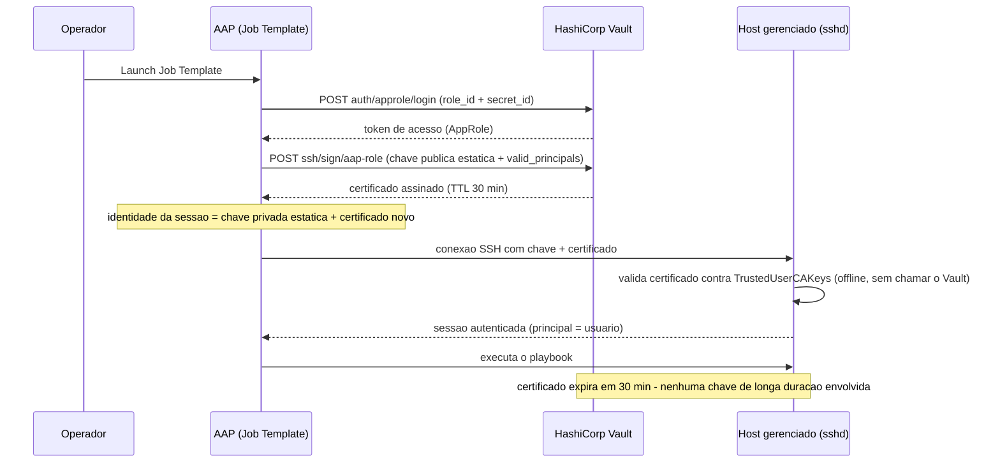

# POC: SSH assinado via HashiCorp Vault + AAP

Substitui chave SSH estática de longa duração por certificados de curta duração
(30 min), assinados sob demanda pelo Vault a cada execução de job no AAP.

## Como funciona

A chave privada usada pelo AAP é estática (gerada uma vez), mas sozinha não abre
sessão em lugar nenhum — o host só confia em conexões acompanhadas de um
certificado válido assinado pela CA do Vault. Como o certificado expira em 30
minutos, uma credencial vazada perde valor rapidamente sem precisar de revogação
manual.

## Estrutura

| Caminho | Conteúdo |
|---|---|
| [`docs/guia-configuracao.md`](docs/guia-configuracao.md) | Passo a passo de configuração — Vault, AAP, host gerenciado |
| [`playbooks/demo.yml`](playbooks/demo.yml) | Playbook de demonstração usado no Job Template do AAP |
| [`scripts/vault/`](scripts/vault/) | Scripts que automatizam a configuração do Vault (CA, role, policy, AppRole) |
| `lab/` | Notas do ambiente de laboratório usado para validar esta POC (não faz parte da solução) |

## Referência

https://www.hashicorp.com/en/blog/managing-ansible-automation-platform-aap-credentials-at-scale-with-vault
